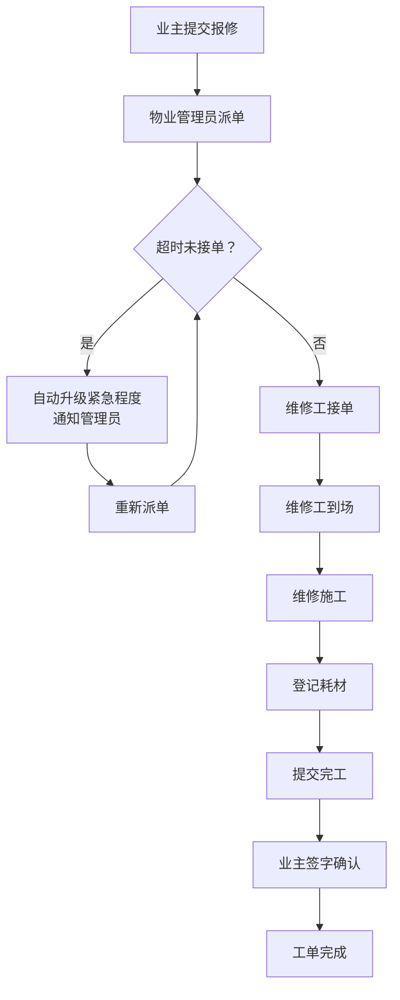

## 1. 产品概述

小区物业报修管理系统，用于解决业主报修登记、物业派单、维修工处理、业主确认的全流程管理问题。面向小区业主、物业管理员、维修工人三类用户，实现报修工单的高效流转与智能管理。

- 主要解决传统报修流程效率低、响应慢、状态不透明的痛点
- 目标是提升物业服务质量，缩短报修响应时间，实现工单全流程可追溯

## 2. 核心功能

### 2.1 用户角色

| 角色 | 注册方式 | 核心权限 |
|------|----------|----------|
| 业主 | 房号绑定 | 提交报修申请、查看报修进度、签字确认完工 |
| 物业管理员 | 后台账号 | 查看所有工单、派单给维修工、处理超时升级、查看统计报表 |
| 维修工 | 后台账号 | 查看待接单列表、接单、更新到场/完工状态、登记耗材使用 |

### 2.2 功能模块

1. **首页仪表盘**：工单统计概览、紧急工单提醒、待处理事项
2. **报修登记页面**：业主填写报修信息（房号/报修类型/问题描述/紧急程度/上传图片）
3. **工单管理页面**：物业管理员查看所有工单、派单、筛选搜索
4. **维修工工作台**：待接单列表、进行中工单、已完工工单、状态流转操作
5. **工单详情页面**：完整工单信息、时间轴、耗材登记、签字确认
6. **维修工管理**：维修工信息维护、技能标签、工作状态

### 2.3 页面详情

| 页面名称 | 模块名称 | 功能描述 |
|-----------|-------------|---------------------|
| 首页仪表盘 | 统计卡片 | 待处理/进行中/已完工工单数、今日新增、平均响应时长 |
| 首页仪表盘 | 紧急工单提醒 | 红色高亮显示紧急报修工单，显示剩余响应时间 |
| 首页仪表盘 | 工单趋势图 | 近7日报修数量趋势折线图 |
| 报修登记 | 报修表单 | 房号选择、报修类型下拉（水电/墙面/门窗/管道疏通/家电/其他）、问题描述文本域、紧急程度（普通/紧急/非常紧急）、图片上传 |
| 报修登记 | 提交反馈 | 提交成功提示、工单号、预计响应时间 |
| 工单管理 | 工单列表 | 分页表格展示所有工单，支持按状态/类型/紧急程度/房号筛选 |
| 工单管理 | 派单操作 | 选择维修工派单，支持按技能匹配推荐 |
| 维修工工作台 | 待接单列表 | 显示分配给自己的待接工单，紧急工单置顶 |
| 维修工工作台 | 状态流转 | 接单→到场→完工，每步记录时间与备注 |
| 工单详情 | 信息面板 | 房号、报修人、报修类型、紧急程度、问题描述、图片 |
| 工单详情 | 时间轴 | 报修→派单→接单→到场→完工→确认各节点时间与操作人 |
| 工单详情 | 耗材登记 | 添加/删除使用耗材（名称/数量/单价/金额） |
| 工单详情 | 签字确认 | Canvas手写签名区域、提交确认按钮 |

## 3. 核心流程

业主在报修页面填写房号、选择报修类型（水电/墙面/门窗/管道疏通/家电/其他）、描述问题、选择紧急程度后提交工单。物业管理员在工单管理页面查看新工单，根据报修类型和维修工技能进行派单。维修工在工作台看到待接单列表，紧急工单优先展示并置顶。维修工接单后更新状态为"已接单"，到达现场后更新为"维修中"，完工后更新为"待确认"并登记使用的耗材。业主查看工单详情后进行手写签字确认，工单状态变为"已完成"。若派单后超过指定时间维修工未接单，系统自动将工单升级，标记为高优先级并通知管理员。

## 4. 用户界面设计

### 4.1 设计风格

- **主色调**：深蓝色 (#1e3a5f) 作为品牌主色，代表专业与信任
- **辅助色**：
  - 紧急状态：深红色 (#e53e3e)
  - 警告状态：橙色 (#ed8936)
  - 成功状态：绿色 (#38a169)
  - 信息状态：蓝色 (#3182ce)
- **按钮风格**：圆角矩形（8px），实心主按钮 + 描边次按钮，悬停有微动画
- **字体**：标题使用 "Noto Serif SC"（思源宋体）衬线字体增强专业感，正文使用 "Noto Sans SC"（思源黑体）保证可读性
- **布局风格**：卡片式布局，左侧导航栏 + 顶部面包屑 + 主内容区
- **图标风格**：使用 Lucide 线性图标，简洁现代

### 4.2 页面设计概述

| 页面名称 | 模块名称 | UI元素 |
|-----------|-------------|-------------|
| 首页仪表盘 | 统计卡片 | 渐变背景卡片，数值大号字体，趋势小箭头指示器 |
| 首页仪表盘 | 紧急工单 | 红色边框脉冲动画，倒计时显示 |
| 报修登记 | 表单区域 | 分组卡片布局，必填项红星标记，实时表单验证 |
| 工单管理 | 工单列表 | 斑马纹表格，紧急程度色标签，状态胶囊按钮 |
| 维修工工作台 | 工单卡片 | 堆叠式卡片，紧急工单红色顶部条，操作按钮组 |
| 工单详情 | 时间轴 | 垂直时间轴，节点带状态图标与连接线 |
| 工单详情 | 签字板 | Canvas签名区，支持清空与重签，笔宽可调节 |

### 4.3 响应式设计

- 桌面端优先设计（1440px及以上）
- 平板端（768-1024px）：左侧导航收起为图标模式，卡片自适应两列
- 移动端（768px以下）：顶部汉堡菜单导航，卡片单列堆叠，表格转卡片视图
- 签字板区域触摸优化，支持手指手写签名

### 4.4 动效设计

- 页面加载：元素渐入 + 轻微上移动画（stagger 100ms）
- 紧急工单：红色边框呼吸脉冲动画（2秒周期）
- 状态变更：状态标签颜色渐变过渡
- 按钮悬停：背景色过渡 + 轻微缩放（scale 1.02）
- 签字确认：提交后签名画布渐变为绿色边框成功状态
