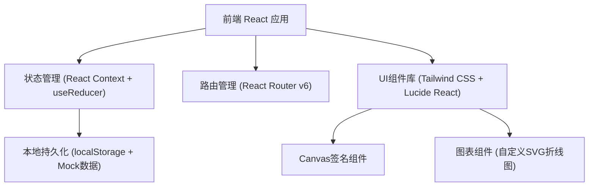
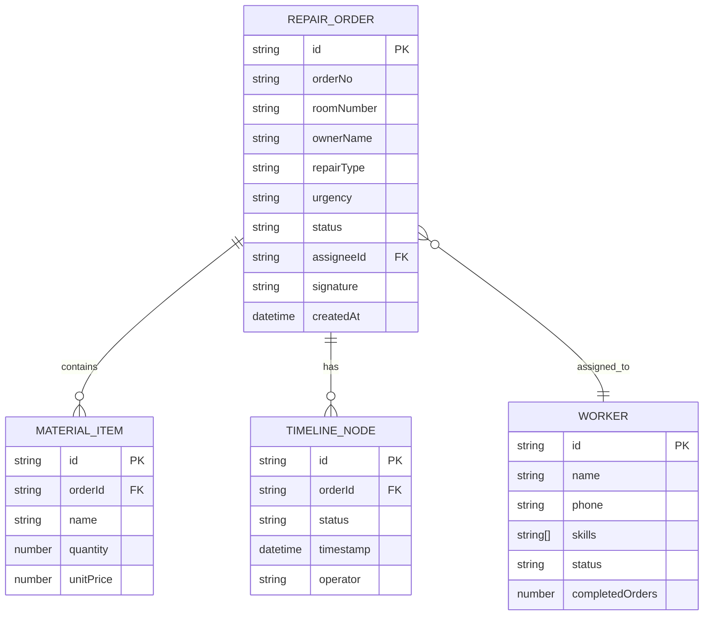

## 1. 架构设计



## 2. 技术描述

- **前端框架**：React@18 + TypeScript + Vite
- **样式方案**：Tailwind CSS@3
- **路由管理**：React Router v6
- **状态管理**：React Context + useReducer（全局工单状态）
- **图标库**：Lucide React
- **数据存储**：localStorage 本地持久化 + Mock初始数据
- **初始化工具**：Vite

由于这是一个前端演示系统，不设置后端服务，所有数据通过 localStorage 存储在浏览器中，预置丰富的Mock数据用于演示各功能模块。

## 3. 路由定义

| 路由 | 用途 | 对应角色 |
|-------|---------|----------|
| / | 首页仪表盘，展示统计数据与紧急工单 | 管理员/维修工 |
| /repair/new | 业主报修登记页面 | 业主 |
| /orders | 工单管理列表页面 | 管理员 |
| /orders/:id | 工单详情页面（含耗材登记、签字确认） | 全部角色 |
| /workbench | 维修工工作台（接单/状态流转） | 维修工 |
| /workers | 维修工管理页面 | 管理员 |

## 4. 类型定义（TypeScript）

```typescript
// 报修类型
type RepairType = '水电' | '墙面' | '门窗' | '管道疏通' | '家电' | '其他';

// 紧急程度
type UrgencyLevel = '普通' | '紧急' | '非常紧急';

// 工单状态
type OrderStatus = '待派单' | '已派单' | '已接单' | '维修中' | '待确认' | '已完成' | '已取消';

// 维修工技能
type WorkerSkill = RepairType;

// 用户角色
type UserRole = 'owner' | 'admin' | 'worker';

// 耗材项
interface MaterialItem {
  id: string;
  name: string;
  quantity: number;
  unitPrice: number;
  totalPrice: number;
}

// 时间轴节点
interface TimelineNode {
  status: OrderStatus;
  timestamp: string;
  operator: string;
  remark?: string;
}

// 工单
interface RepairOrder {
  id: string;
  orderNo: string;
  roomNumber: string;
  ownerName: string;
  ownerPhone: string;
  repairType: RepairType;
  urgency: UrgencyLevel;
  description: string;
  images?: string[];
  status: OrderStatus;
  assigneeId?: string;
  assigneeName?: string;
  materials: MaterialItem[];
  signature?: string; // base64
  timeline: TimelineNode[];
  createdAt: string;
  updatedAt: string;
  autoEscalated: boolean;
  lastEscalationTime?: string;
}

// 维修工
interface Worker {
  id: string;
  name: string;
  phone: string;
  skills: WorkerSkill[];
  status: '空闲' | '忙碌' | '休息';
  avatar?: string;
  completedOrders: number;
}

// 用户
interface User {
  id: string;
  role: UserRole;
  name: string;
  roomNumber?: string;
}
```

## 5. 数据模型与Mock数据

### 5.1 实体关系图



### 5.2 Mock初始数据

系统预置以下Mock数据：
- 12条示例工单（覆盖各状态、各报修类型、各紧急程度）
- 5名维修工（各有不同技能标签与工作状态）
- 7日报修趋势统计数据
- 3种角色的模拟用户（可切换演示）

## 6. 核心业务逻辑模块

### 6.1 工单状态机

```
待派单 → 已派单 → 已接单 → 维修中 → 待确认 → 已完成
  ↓         ↓        ↓        ↓        ↓
  └─────── 已取消 (任意环节可取消)
```

### 6.2 超时自动升级机制

- 已派单状态超过 15 分钟未接单 → 自动升级紧急程度一级 + 标记 autoEscalated=true
- 定时检查：使用 setInterval 每 30 秒扫描一次所有已派单工单
- 升级后：通知管理员（页面顶部Toast提示），紧急工单置顶显示

### 6.3 紧急工单优先级排序

工单列表排序规则：
1. 紧急程度（非常紧急 > 紧急 > 普通）
2. 创建时间（越早越优先）
3. 是否已自动升级标记（升级过的更优先）
